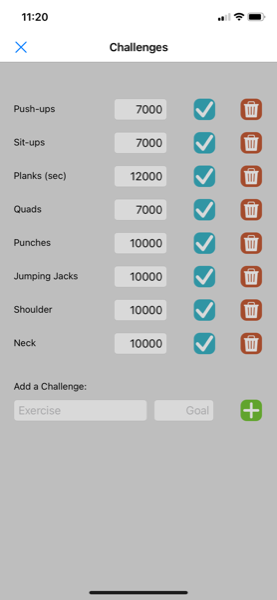

# Pythonista Fitness Tracker - RepTracker

**Keep track of your fitness goals.** 
This Pythonista-based fitness tracker helps you stay motivated by letting you:

- Set custom goals for a year e. g. 10,000 push-ups
- Log your completed repetitions
- Get visual feedback with ring progress charts

---
## Screenshots

